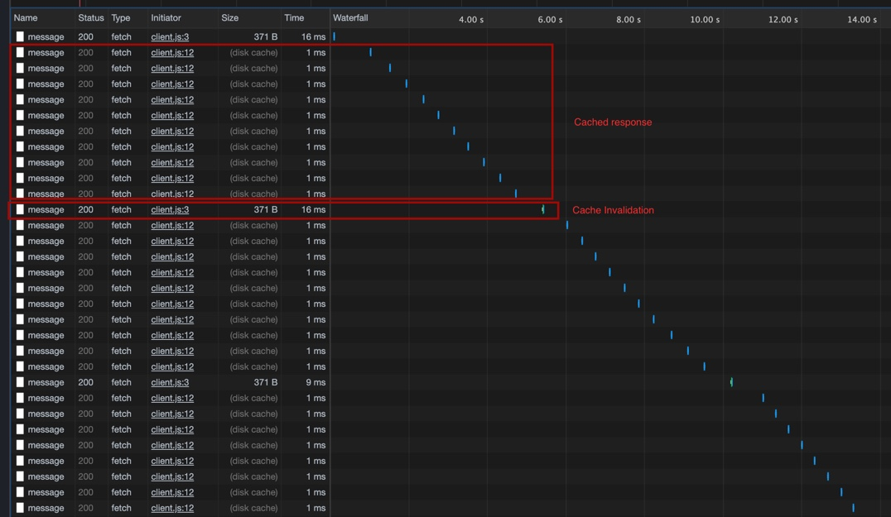

# Description

This stack is meant to demo how http caching works, and how to force browser cache invalidation.
It's based on https://tools.ietf.org/html/rfc2616#section-14.9

# Running the stack

`docker-compose up`

Access the app on http://localhost:3000/

# Example

